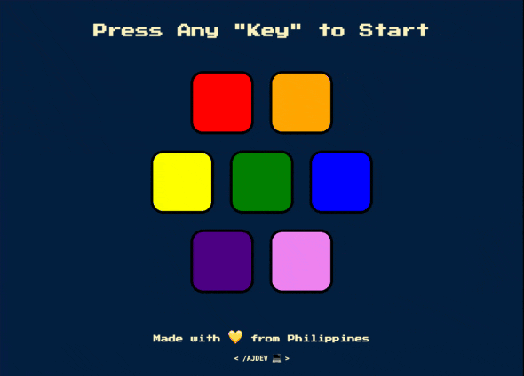

# Mini-game Project: "simon-game-ajdev"

--------

--------

### Basic Instructions of game:
- User must click any key to start the sequence of the game.
- User must remember the sequence of the game pattern.
- Every sequence must be added on the last part of the user selected sequence.
- If the user choose the wrong color, then it will be "Game Over" and repeat the same instructions.